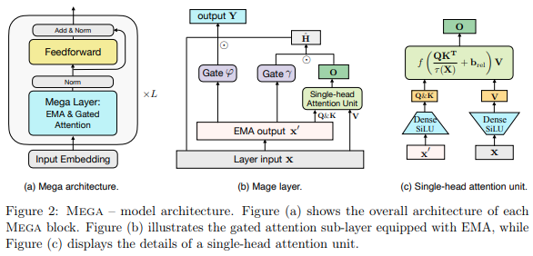

</img>

## Mega - Moving Average Equipped Gated Attention - Pytorch

Implementation of the <a href="https://arxiv.org/abs/2209.10655">Mega</a> layer, the Single-head Attention with Multi-headed EMA layer that exists in the architecture that currently holds SOTA on Long Range Arena, beating S4 on Pathfinder-X and all the other tasks save for audio.

## Install

```bash
$ pip install mega-pytorch
```

## Usage

The Mega Layer with combination of attention and learned EMA

```python
import torch
from mega_pytorch import MegaLayer

layer = MegaLayer(
    dim = 128,                   # model dimensions
    ema_heads = 16,              # number of EMA heads
    attn_dim_qk = 64,            # dimension of queries / keys in attention
    attn_dim_value = 256,        # dimension of values in attention
    laplacian_attn_fn = False,   # whether to use softmax (false) or laplacian attention activation fn (true)
)

x = torch.randn(1, 1024, 128)     # (batch, seq, dim)

out = layer(x) # (1, 1024, 128)
```

Full Mega (with layernorm for now)

```python
import torch
from mega_pytorch import Mega

mega = Mega(
    num_tokens = 256,            # number of tokens
    dim = 128,                   # model dimensions
    depth = 6,                   # depth
    ema_heads = 16,              # number of EMA heads
    attn_dim_qk = 64,            # dimension of queries / keys in attention
    attn_dim_value = 256,        # dimensino of values in attention
    laplacian_attn_fn = True,    # whether to use softmax (false) or laplacian attention activation fn (true)
)

x = torch.randint(0, 256, (1, 1024))

logits = mega(x) # (1, 1024, 256)
```

## Todo

- [ ] add dynamic positional bias for best length extrapolation arch

## Citations

```bibtex
@inproceedings{Ma2022MegaMA,
    title   = {Mega: Moving Average Equipped Gated Attention},
    author  = {Xuezhe Ma and Chunting Zhou and Xiang Kong and Junxian He and Liangke Gui and Graham Neubig and Jonathan May and Luke Zettlemoyer},
    year    = {2022}
}
```
